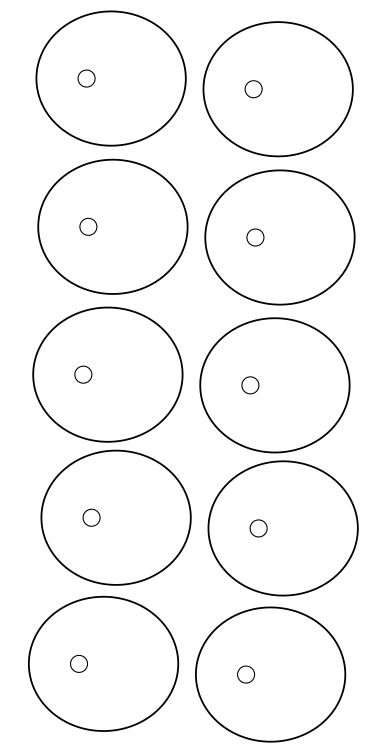
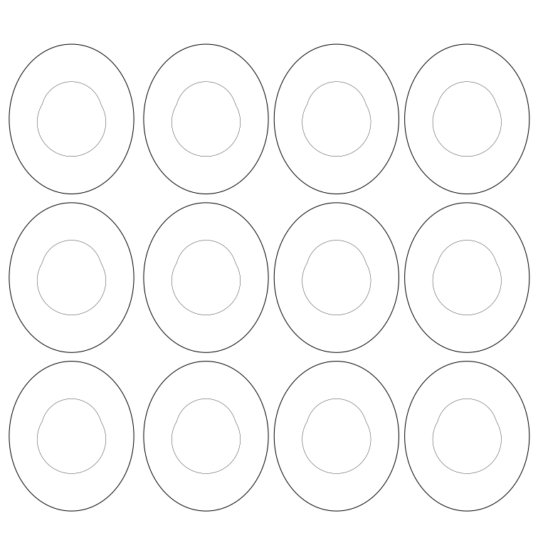
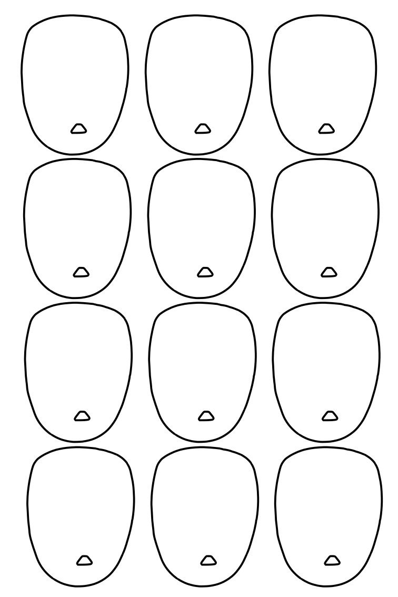
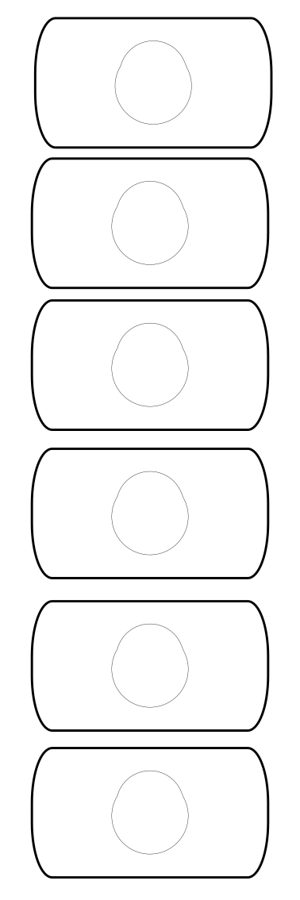
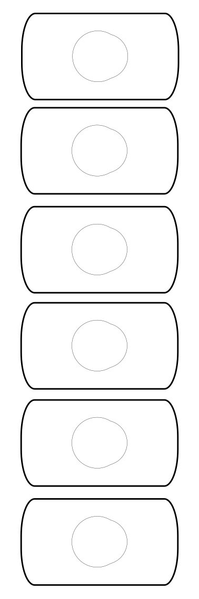

# Patches for Dexcom G7 and Omnipod Dash

This repository contains vector graphics (SVG) for creating your own
overpatches and underpatches for:

- Dexcom G7
- Omnipod Dash

The files are set up to work well with cutting plotters or laser cutters.

## Contents

- The SVG files are stored in `files/`.

- `files/`
  - `Dexcom_G7_Underpatch_Fixomull.svg`
  - `Dexcom_G7_Overpatch_Fixomull_White.svg`
  - `Omnipod_Dash_Underpatch_Fixomull.svg`
  - `Dexcom_G7_Overpatch_Tegaderm.svg`
  - `Dexcom_G7_Overpatch_Tegaderm_90deg.svg`

## How to use

1. Open the SVG file in your preferred software (e.g., Inkscape,
   Illustrator, Silhouette Studio).
2. Choose your material (e.g., Fixomull or Tegaderm).
3. Keep the scale at 100% unless your software auto-scales.
4. Cut or plot.

## Previews

PNG previews are stored in `images/`.







To regenerate previews:

```bash
./scripts/export_pngs.sh
```

## Material notes

- Fixomull and Tegaderm are common adhesive patch materials.
- Use skin-safe adhesives and clean cut edges.
- Always test new materials on a small area first.

## Tegaderm Roll details

- Name: Tegaderm Roll
- Manufacturer: 3M
- German PZN: PZN-03816512

### Silhouette Portrait settings (Tegaderm)

- Orientation: side "1" up (the side printed with green arrows and a white "1")
- Speed: 4
- Pressure: 33
- Repeat each stroke: 2

## Fixomull stretch details

- Name: Fixomull stretch
- Manufacturer: Leukoplast
- German PZN: PZN-04539552

### Silhouette Portrait settings (Fixomull)

- Orientation: smooth side up
- Pressure: 33
- Speed: 4
- Repeat each stroke: 2

## Disclaimer

Use at your own risk. This project does not replace medical advice.
For questions about use, please contact medical professionals.

## License

Creative Commons Attribution 4.0 International (CC BY 4.0). See `LICENSE`.
